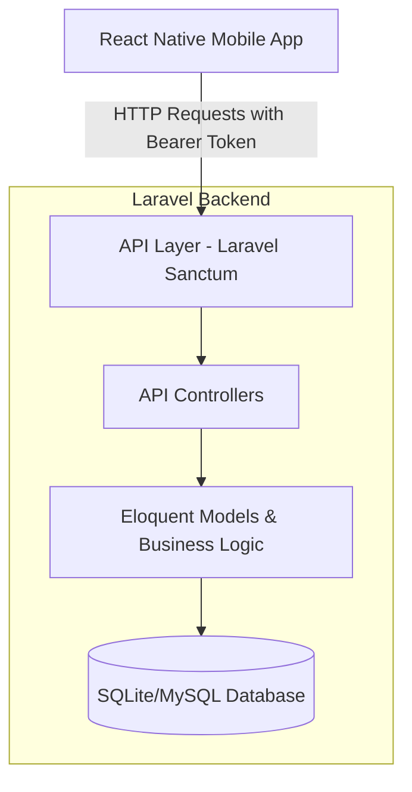
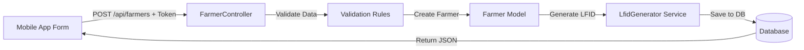

# Mobile App Architecture Overview

## System Architecture



## Authentication Flow


## Data Entry Flow (Farmer Example)



## API Endpoint Structure

```
┌─────────────────────────────────────┐
│   Public Routes (No Auth Required)  │
├─────────────────────────────────────┤
│ POST /api/register                  │
│ POST /api/login                     │
└─────────────────────────────────────┘

┌─────────────────────────────────────┐
│   Protected Routes (Bearer Token)   │
├─────────────────────────────────────┤
│ GET  /api/user                      │
│ POST /api/logout                    │
│                                     │
│ GET    /api/farmers                 │
│ POST   /api/farmers                 │
│ GET    /api/farmers/{id}            │
│ PUT    /api/farmers/{id}            │
│ DELETE /api/farmers/{id}            │
│                                     │
│ GET    /api/farmers/{id}/profile    │
│ PUT    /api/farmers/{id}/profile    │
└─────────────────────────────────────┘
```

## Request/Response Format

### Request (from Mobile App)
```
POST /api/farmers
Headers:
  Authorization: Bearer 1|abc123...
  Content-Type: application/json
  
Body:
{
  "first_name": "Juan",
  "last_name": "Dela Cruz",
  ...
}
```

### Response (from Laravel)
```json
{
  "success": true,
  "message": "Farmer created successfully.",
  "data": {
    "id": 1,
    "first_name": "Juan",
    "last_name": "Dela Cruz",
    "lfid": "LFID-2026-0001",
    ...
  }
}
```

## Database Schema Integration

```
Farmers Table
├── id (primary key)
├── lfid (auto-generated)
├── first_name
├── last_name
├── enrollment_type
├── ... other fields
└── timestamps

Related Tables (auto-loaded via Eloquent relationships)
├── farmer_profiles
├── farmer_addresses
├── farmer_contacts
├── farms
├── farming_activities
├── farmer_documents
└── ... etc
```

## Security Layers

```
┌─────────────────────────────────┐
│     Mobile App (React Native)   │
│  - AsyncStorage for tokens      │
│  - Axios interceptors           │
└─────────────────────────────────┘
              ↓
┌─────────────────────────────────┐
│     CORS Configuration          │
│  - Allowed origins              │
│  - Allowed headers              │
└─────────────────────────────────┘
              ↓
┌─────────────────────────────────┐
│  Sanctum Token Authentication   │
│  - Bearer token validation      │
│  - Token abilities              │
└─────────────────────────────────┘
              ↓
┌─────────────────────────────────┐
│  Controller Validation          │
│  - Input validation             │
│  - Authorization checks         │
└─────────────────────────────────┘
              ↓
┌─────────────────────────────────┐
│  Business Logic Layer           │
│  - Models                       │
│  - Services (LFID Generator)    │
│  - Relationships                │
└─────────────────────────────────┘
```

## Key Features Preserved from Web App

✅ **LFID Auto-Generation** - Same service used  
✅ **Validation Rules** - Reused from web controllers  
✅ **Relationship Loading** - All farmer data included  
✅ **Cascade Deletes** - Database integrity maintained  
✅ **Business Logic** - No duplication, same backend  

---

This architecture ensures your React Native mobile app has full access to all the features and business logic of your existing web application!
